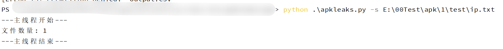
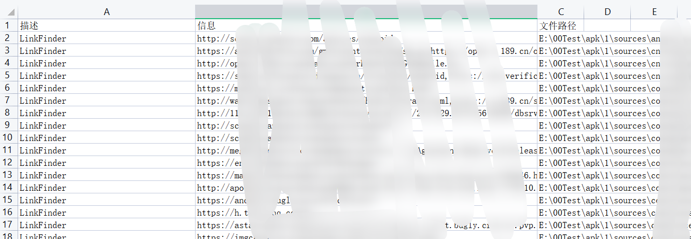
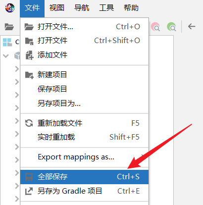
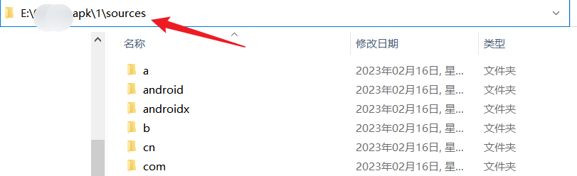
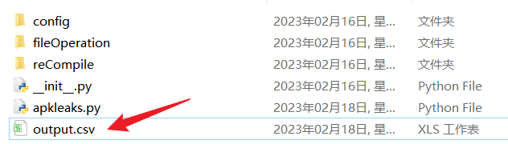

# fileleaks
 search sensetive information in files by re

## 0x00 介绍

读取指定的文件或目录，正则匹配文件中是否存在需要的信息


## 0x01 功能说明

```
python .\fileleaks.py -h

从文件中搜索敏感信息

optional arguments:
  -h, --help     show this help message and exit
  -s SOURCEFILE  原文件或目录
  -o OUTFILE     将结果导出为csv
  -t THREADS     设置的线程数量，默认为20
```


### 添加正则

正则文件在config/reDict.yaml中，在于yaml格式


1. 因为采用的是re的findall方法，所以如果你在正则表达式中存在()且你想要的是整体还不算括号中的内容，你需要在表达式外加一个()

比如：ip正则表达式

```
((\d|[1-9]\d|1\d\d|2[0-4]\d|25[0-5])\.){3}(\d|[1-9]\d|1\d\d|2[0-4]\d|25[0-5])
```

我们需要的是这个整体，就需要在外面加一个()

```
(((\d|[1-9]\d|1\d\d|2[0-4]\d|25[0-5])\.){3}(\d|[1-9]\d|1\d\d|2[0-4]\d|25[0-5]))
```


2. 如果表达式读取表达式报错，可以尝试将外面的""替换为''
3. 在添加正则后请用测试文件测试一下能否达到预期的目标，防止白费功夫
4. reDict.yaml的写法

如果只有一个正则表达式写法如下：

```
Authorization_Basic: "basic\\s[a-zA-Z0-9_\\-:\\.=]+"
```

Authorization_Basic可以加双引号也可以不加，如果key存在空格需要加双引号

如果一个key对应多个正则，写法如下

```
"LinkFinder":
- "<link.*?href=\"(.*?)\""
- "<script.*?src=\"(.*?)\""
- "(<form.*?action=\".*?)\">"
- 'http[s]?://(?:[a-zA-Z]|[0-9]|[$-_@.&+]|[!*\(\),]|(?:%[0-9a-fA-F][0-9a-fA-F]))+'
```

5. 如果大伙有好用的正则欢迎提交issues告诉我，我会及时更新到配置文件中


## 0x02 使用

```
python .\fileleaks.py -s 文件或目录的路径
```

案例：

python .\fileleaks.py -s E:\xxx\apk\1\test\ip.txt






### 注意

如果出现报错 PermissionError: [Errno 13] Permission denied: 'output.csv'，可能是因为output.csv被其他软件打开了，解决办法是关闭该文件或者换一个文件名

```
python .\fileleaks.py -s filepath -o output1.csv
```


## 0x03 案例

#### 读取apk逆向后的源码信息

在github下载jadx https://github.com/skylot/jadx

然后将apk拖进jadx中，等编译完成后点击全部保存



就会看到指定目录下有一个resource文件



搜索该目录中的敏感信息

```
python .\fileleaks.py -s E:\xxx\apk\1\sources
```

等执行完毕后就会看到这个csv文件

